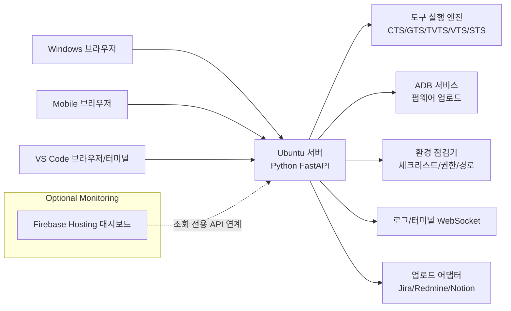

# Google Auth Helper

Ubuntu에서 Google 인증 도구(CTS/GTS/TVTS/VTS/STS/CTS-on-GSI)를 실행하고, 웹 UI로 테스트 자동화/모니터링을 제공하는 Python 서버입니다.

## 핵심 방향
- 실행 중심: Ubuntu Linux 서버
- 접근 방식: 브라우저 웹 UI(Windows/Mobile 포함)
- 원칙: 환경이 100% 준비되지 않아도 프로그램은 실행, 기능별 활성/비활성 표시

## 아키텍처 다이어그램


## Firebase Hosting 활용 의견
가능합니다. 다만 제어 기능(테스트 시작/중지)은 Ubuntu 내부망 정책과 보안 이슈가 커서, 초기에는 Firebase를 조회 전용(대시보드/리포트 열람)으로 제한하는 구성이 안전합니다.

권장 분리:
- Control UI: Ubuntu 서버에서 직접 제공(운영 제어)
- Monitor UI: Firebase Hosting에서 제공(조회 중심)

## 빠른 실행
```bash
python -m venv .venv
source .venv/bin/activate
pip install -r requirements.txt
uvicorn app.main:app --host 0.0.0.0 --port 8000
```

브라우저 접속: `http://<ubuntu-server-ip>:8000`

## 로컬 실행(브라우저 자동 오픈)
```bash
python run_local.py
```

옵션:
```bash
python run_local.py --host 0.0.0.0 --port 8000
python run_local.py --no-browser
```

## 현재 구현 범위(MVP)
- 환경 점검 API(`/api/environment/check`)
- 도구 활성/비활성 상태 표시(`/api/tools`)
- 테스트 작업 시작/취소/입력/조회 API(`/api/jobs/*`)
- 실시간 로그 WebSocket(`/ws/logs`)
- 실시간 터미널 WebSocket(`/ws/terminal`)
- 펌웨어 업로드 + adb push(`/api/firmware/upload`)
- Jira/Redmine/Notion 어댑터 뼈대(`/api/reports/upload`)
- 결과서 자동 분석 + 저장(`/api/reports/import-file`)
- 저장 결과서 목록/상세 조회(`/api/reports/runs`, `/api/reports/runs/{id}`)
- 대시보드 그래프 데이터(`/api/analytics/dashboard`)
- 조회 전용 모니터링 API(`/api/monitor/summary`)

## 디렉터리
```text
app/
  main.py
  config.py
  models.py
  services/
  static/
docs/
  architecture.md
  dev-logs/
```

## 개발로그 규칙
개발 중 체크리스트 항목이 완료될 때마다 `docs/dev-logs/`에 마크다운 로그를 추가합니다.

## 모니터링 API(Firebase 조회 전용)
- 엔드포인트: `GET /api/monitor/summary`
- 헤더: `x-monitor-token: <MONITOR_API_TOKEN>`
- `.env`에 `MONITOR_API_TOKEN`이 비어 있으면 토큰 없이도 조회 가능

## Ubuntu 서비스 배포
- 서비스 파일: `deploy/google-auth-helper.service`
- 설치 스크립트: `scripts/install_systemd.sh`
- 상세 가이드: `docs/ubuntu-deploy.md`

## 추가 문서
- Firebase 조회 전용 연동 가이드: `docs/firebase-monitoring.md`
