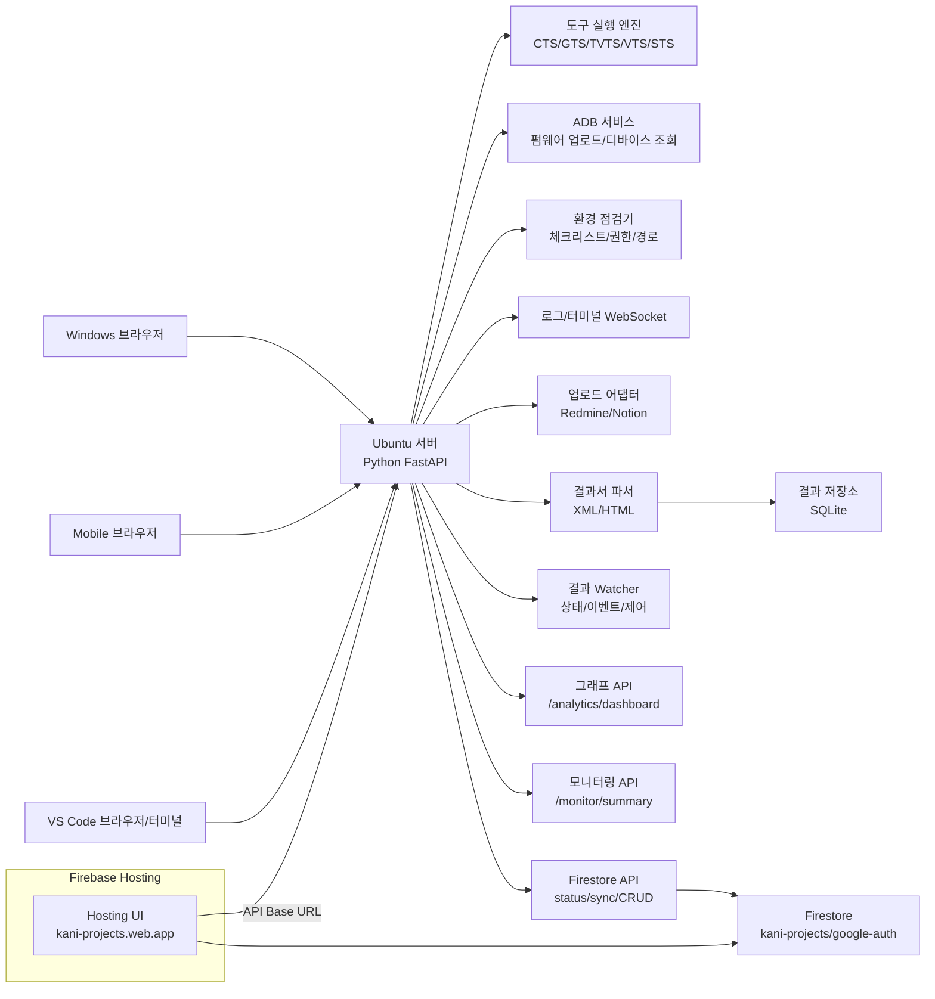
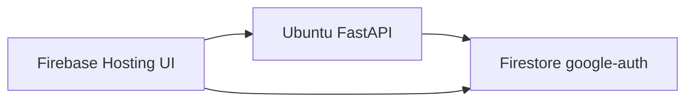

# 아키텍처 설명 (현행)

## 1) 전체 구조

## 2) 주요 API 계층
- 실행/제어: `/api/jobs/*`, `/api/adb/devices`, `/api/firmware/upload`
- 결과 처리: `/api/reports/import-file`, `/api/reports/runs*`, `/api/reports/upload`
- Watcher: `/api/watcher/status`, `/api/watcher/events`, `/api/watcher/enable`, `/api/watcher/disable`, `/api/watcher/scan-now`
- 시각화/모니터링: `/api/analytics/dashboard`, `/api/monitor/summary`
- Firebase/Firestore: `/api/firebase/status`, `/api/firebase/firestore/*`, `/api/firebase/sync/runs`, `/api/firebase/sync/monitor`
- 실시간 채널: `/ws/logs`, `/ws/terminal`

## 3) 도구/결과 경로 모델
- `.env`의 `*_TOOL_PATH`, `*_RESULTS_DIR`, `*_LOGS_DIR` 사용
- `TOOL_PATH`는 파일/디렉터리 모두 허용
- 디렉터리일 때 실행파일 탐색:
1. `<tool_path>/<명령어>`
2. `<tool_path>/bin/<명령어>`
3. `<tool_path>/tools/<명령어>`
- 결과 watcher는 도구별 `results` 경로를 주기 스캔하고 XML/HTML을 자동 import

상세는 `docs/tool-setup.md` 참고

## 4) 데이터 흐름
1. 결과 파일 수집(수동 업로드 또는 watcher 자동 수집)
2. `ReportParser`가 fail/metadata 추출
3. `ResultStore(SQLite)`에 run/case 저장
4. 대시보드/목록/상세 API로 조회
5. 필요 시 Redmine/Notion 업로드
6. Firestore 동기화 API로 `google-auth` 컬렉션 갱신

## 5) Firebase Hosting 연계
- Hosting UI는 정적 화면 제공
- 백엔드 호출은 UI 상단 `API Base URL`로 Ubuntu API에 연결
- Firestore 데이터는 Hosting UI와 Ubuntu API가 공용으로 사용

