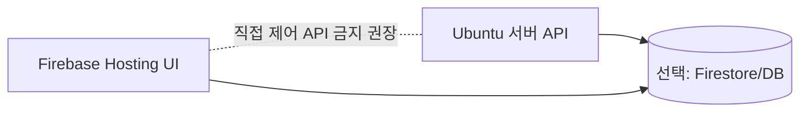

# 아키텍처 설명

## 1) 왜 Ubuntu 서버 + 웹 UI인가
- Google 인증 도구 실행 환경이 Ubuntu에 최적화되어 있음
- 테스트 실행 엔진은 서버에 고정하고, UI를 웹으로 분리하면 Windows/Mobile에서 동일 화면 접근 가능
- Python 단일 언어로 서버/자동화/연동 계층을 일관되게 구현 가능

## 2) 계층 구조
```text
[Web UI]
  - 대시보드
  - 실행/중지/재시도
  - 로그/터미널
      |
      v
[FastAPI API 계층]
  - /api/environment/check
  - /api/tools
  - /api/jobs/*
  - /api/firmware/upload
  - /api/reports/upload
  - /ws/logs, /ws/terminal
      |
      v
[서비스 계층]
  - EnvironmentChecker
  - ToolRegistry
  - JobRunner
  - AdbService
  - IntegrationDispatcher
      |
      v
[실행 대상]
  - CTS/GTS/TVTS/VTS/STS/CTS-on-GSI
  - adb
  - Jira/Redmine/Notion API
```

## 3) 동작 시나리오
1. 서버 시작 시 환경 검사 준비
2. UI에서 환경 점검 실행
3. 도구가 없으면 해당 테스트 비활성 표시
4. 사용자가 테스트 시작 시 JobRunner가 subprocess로 실행
5. stdout/stderr는 WebSocket으로 실시간 전달
6. 실패 항목은 외부 시스템 업로드 API 호출

## 4) Firebase Hosting 연계(조회 전용 권장)


설명:
- Firebase UI는 모니터링/조회 중심으로 두고,
- 테스트 실행/취소 같은 제어 기능은 Ubuntu 서버 내부 UI에서 수행하는 것이 안전합니다.

