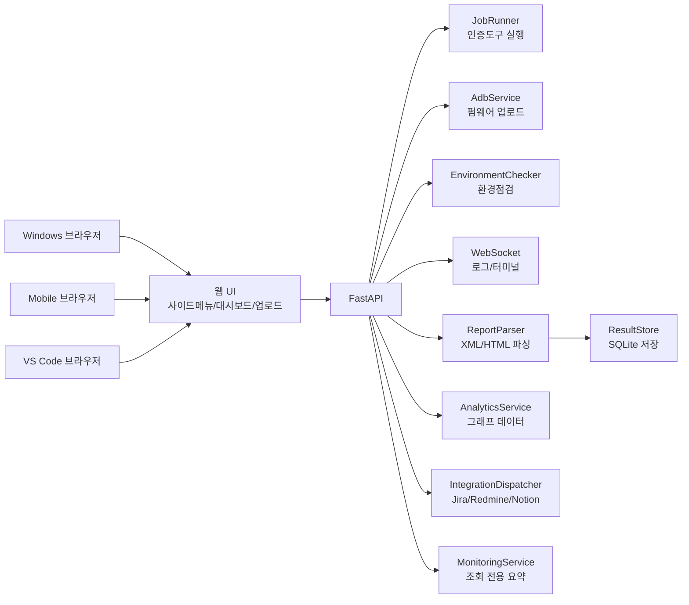
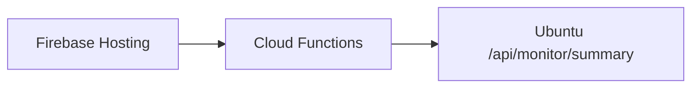

# 아키텍처 설명 (현행)

## 1) 전체 구조

## 2) 주요 API 계층
- 테스트 실행: `/api/jobs/*`
- 결과서 파싱/저장: `/api/reports/import-file`, `/api/reports/runs*`
- 업로드 연동: `/api/reports/upload`
- 대시보드 그래프: `/api/analytics/dashboard`
- 조회 전용 모니터링: `/api/monitor/summary`
- 실시간 채널: `/ws/logs`, `/ws/terminal`

## 3) 도구 경로 설정 모델
- `.env`에 `CTS_TOOL_PATH`, `GTS_TOOL_PATH` 등 지정
- 파일 경로/디렉터리 경로 모두 허용
- 디렉터리일 때 실행파일 탐색:
1. `<tool_path>/<명령어>`
2. `<tool_path>/bin/<명령어>`
3. `<tool_path>/tools/<명령어>`

상세는 `docs/tool-setup.md` 참고

## 4) 데이터 흐름
1. 결과 파일 업로드
2. ReportParser가 fail/metadata 추출
3. ResultStore(SQLite)에 전체 케이스 저장
4. 대시보드/목록/상세 화면에서 조회
5. 필요 시 외부 이슈 시스템으로 업로드

## 5) Firebase Hosting 연계
조회 전용으로만 사용 권장:

- 토큰은 Functions(서버측)에서 보관
- 클라이언트에서 Ubuntu API를 직접 호출하지 않는 구성 권장

