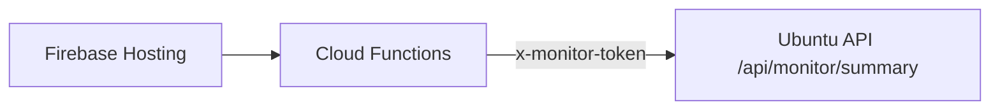

# Firebase Hosting 조회 전용 연동 가이드

## 목표
- 테스트 제어는 Ubuntu 서버에서 수행
- Firebase Hosting은 조회/대시보드만 제공

## 권장 구조


설명:
- Hosting 클라이언트에서 Ubuntu API를 직접 호출하면 토큰이 노출될 수 있습니다.
- Cloud Functions를 프록시로 두고 서버 측에서 토큰을 보관하는 구성을 권장합니다.

## Ubuntu API
- 엔드포인트: `GET /api/monitor/summary`
- 헤더: `x-monitor-token: <MONITOR_API_TOKEN>`
- `.env`에 `MONITOR_API_TOKEN`을 설정하지 않으면 토큰 없이 조회 가능

응답 예시:
```json
{
  "generated_at": "2026-03-05T00:00:00.000000",
  "platform_focus": "ubuntu-linux",
  "environment": { "ok": 5, "warn": 3, "error": 0 },
  "tools": {
    "available": 4,
    "unavailable": 2,
    "details": []
  },
  "jobs": {
    "total": 10,
    "running": 1,
    "failed": 2,
    "latest": []
  }
}
```

## Cloud Functions 예시(개념)
1. Functions 환경 변수에 `MONITOR_API_TOKEN` 저장
2. Functions에서 Ubuntu API 호출 후 JSON 반환
3. Firebase Hosting 페이지에서 Functions만 호출

