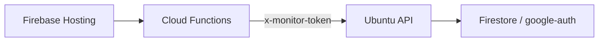

# Firebase Hosting + Firestore 연동 가이드

## 목표
- 테스트 제어는 Ubuntu 서버에서 수행
- Firebase Hosting(`https://kani-projects.web.app`)은 조회/대시보드 제공
- Firestore(`kani-projects/google-auth`)에 모니터링/결과 요약 저장

## 권장 구조


설명:
- Hosting 클라이언트에서 Ubuntu API를 직접 호출하면 토큰이 노출될 수 있습니다.
- Cloud Functions를 프록시로 두고 서버 측에서 토큰을 보관하는 구성을 권장합니다.

## Ubuntu API
- 엔드포인트: `GET /api/monitor/summary`
- 헤더: `x-monitor-token: <MONITOR_API_TOKEN>`
- `.env`에 `MONITOR_API_TOKEN`을 설정하지 않으면 토큰 없이 조회 가능

추가 Firebase 연동 API:
- `GET /api/firebase/status`
- `POST /api/firebase/sync/runs?limit=20&collection=google-auth`
- `POST /api/firebase/sync/monitor?collection=google-auth`

응답 예시:
```json
{
  "generated_at": "2026-03-05T00:00:00.000000",
  "platform_focus": "ubuntu-linux",
  "environment": { "ok": 5, "warn": 3, "error": 0 },
  "tools": {
    "available": 4,
    "unavailable": 2,
    "details": []
  },
  "jobs": {
    "total": 10,
    "running": 1,
    "failed": 2,
    "latest": []
  }
}
```

## Cloud Functions 예시(개념)
1. Functions 환경 변수에 `MONITOR_API_TOKEN` 저장
2. Functions에서 Ubuntu API 호출 후 JSON 반환
3. Firebase Hosting 페이지에서 Functions만 호출

## Windows PowerShell에서 npm/firebase가 안 될 때
- 증상: `npm`, `npm.cmd`, `firebase`, `firebase.cmd`를 찾지 못함
- 원인: PATH 미반영 또는 PowerShell 실행 정책

즉시 실행(현재 터미널 1회):
```powershell
$env:Path = "C:\Program Files\nodejs;C:\Users\Kim\AppData\Roaming\npm;$env:Path"
npm.cmd -v
firebase.cmd --version
```

지속 사용:
```powershell
powershell -ExecutionPolicy Bypass -File .\scripts\windows-dev-shell.ps1
```

로그인:
```powershell
firebase.cmd login
```

## Firestore 연결 필수 확인값
- `FIREBASE_PROJECT_ID=kani-projects`
- `FIRESTORE_DATABASE_ID=google-auth`
- `FIRESTORE_DEFAULT_COLLECTION=google-auth`
- 인증 택1:
- `FIREBASE_SERVICE_ACCOUNT_FILE=<service-account.json 경로>` (권장)
- `FIREBASE_BEARER_TOKEN=<access token>`
- 개발 PC fallback:
- `firebase.cmd login` 완료 시 `~/.config/configstore/firebase-tools.json`의 access token을 자동 사용(만료 전)
